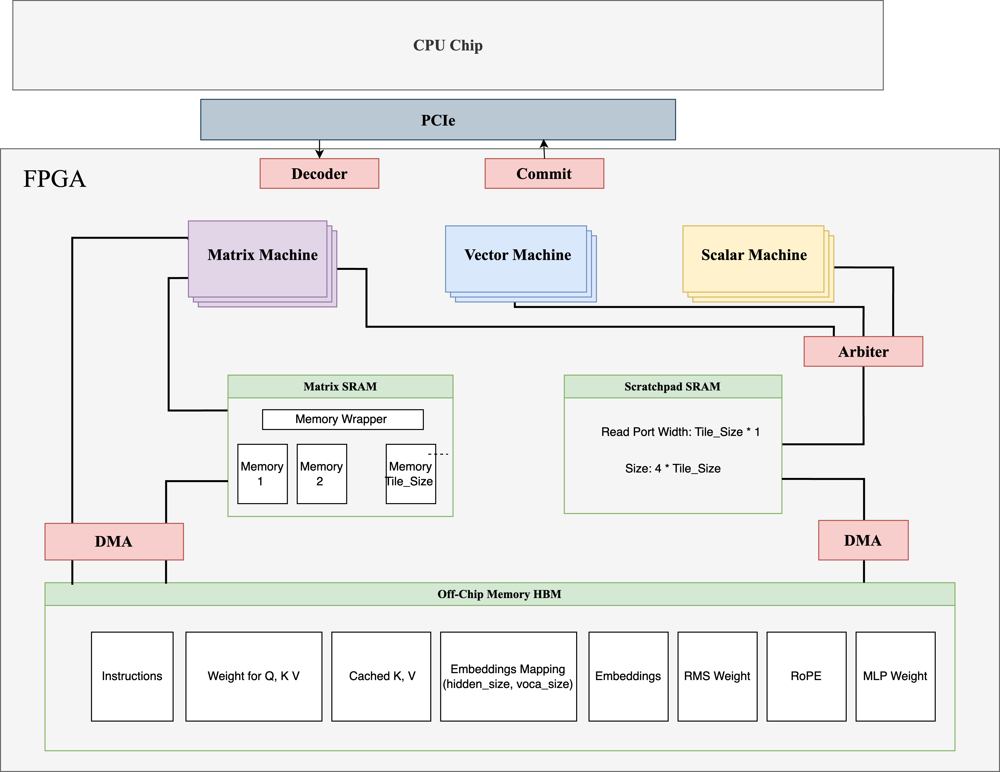

# AIXSim: Llama Acceleration Coprocessor Design

This project contains the implementation of a coprocessor for Llama model's inference process.

**ISA Summary:**  
[View Document on Notion](https://www.notion.so/Custom-ISA-1e228f1ee68e80d29f05ec130b72a3ce?source=copy_link)

**Progress Report:**  
[View Document on Notion](https://www.notion.so/Coprocessor-Project-Plan-1d628f1ee68e8052ab7dc51a36905c15?pvs=4)

**Design Space and Tuning Method:**  
[View Document](src/definitions/config.md)

<!--  -->

**SystemVerilog RTL Format:**  
[LowRISC Format](https://github.com/lowRISC/style-guides)
