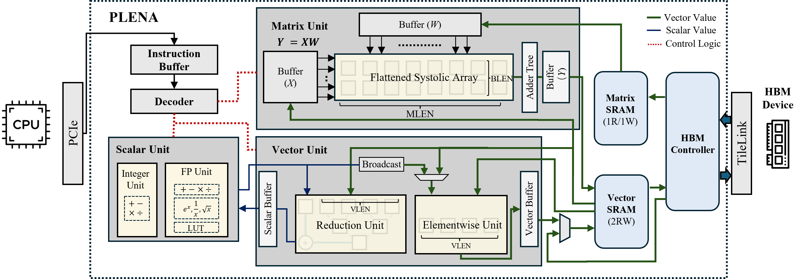

# PLENA: A Programmable Long-context Efficient Neural Accelerator

This repository contains the design and implementation of PLENA. 

## Publications
* Combating the Memory Walls: Optimization Pathways for Long-Context Agentic LLM Inference, [link](https://arxiv.org/abs/2509.09505)
  ```
    @misc{wu2025combatingmemorywallsoptimization,
        title={Combating the Memory Walls: Optimization Pathways for Long-Context Agentic LLM Inference}, 
        author={Haoran Wu and Can Xiao and Jiayi Nie and Xuan Guo and Binglei Lou and Jeffrey T. H. Wong and Zhiwen Mo and Cheng Zhang and Przemyslaw Forys and Wayne Luk and Hongxiang Fan and Jianyi Cheng and Timothy M. Jones and Rika Antonova and Robert Mullins and Aaron Zhao},
        year={2025},
        eprint={2509.09505},
        archivePrefix={arXiv},
        primaryClass={cs.AR},
        url={https://arxiv.org/abs/2509.09505}, 
    }
  ```




**ISA Summary:**  
[View Document on Notion](https://www.notion.so/Custom-ISA-1e228f1ee68e80d29f05ec130b72a3ce?source=copy_link)

**Progress Report:**  
[View Document on Notion](https://www.notion.so/Coprocessor-Project-Plan-1d628f1ee68e8052ab7dc51a36905c15?pvs=4)

**Design Space and Tuning Method:**  
[View Document](src/definitions/config.md)

**SystemVerilog RTL Format:**  
[LowRISC Format](https://github.com/lowRISC/style-guides)


## Configure your environment

```
make build-docker
```

This will help you to download the required non-python related packages for the tool like clang, llvm, verilator, etc.

## install dependencies

```
make shell
```
This command cd into the shell of the docker container.

```
python3 -m venv .coprocessor_env
source .coprocessor_env/bin/activate
pip install -e .
```

The Python environment will be installed locally, allowing you to customize it according to your specific needs

<!-- ```bash --> -->

## Run Simulation

```
just build-behave-sim argsbu
```

