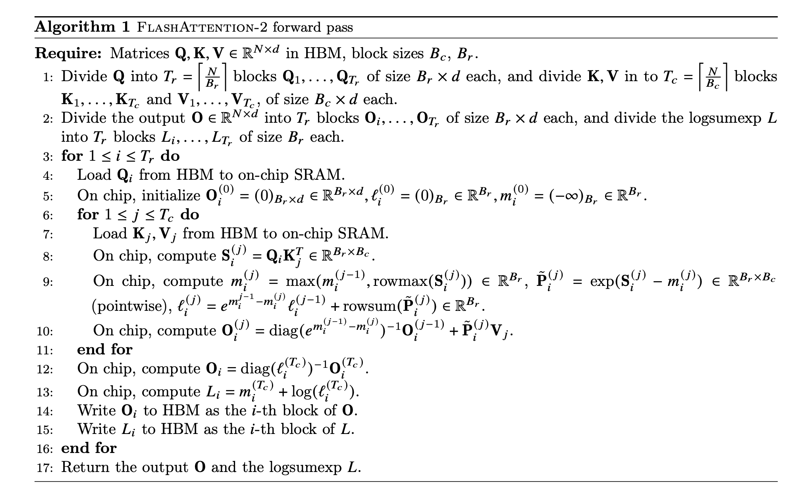

# Flash Attention Assembly Code Generation Notes

---

## Algorithm



---

## Model Config

**Model:** LLaMA-3.1 8B

```json
{
    "architectures": [
        "LlamaForCausalLM"
    ],
    "model_type": "llama",
    "transformers_version": "4.43.0.dev0",

    "batchsize": 1,
    "use_cache": true,
    "torch_dtype": "bfloat16",
    "tie_word_embeddings": false,

    "vocab_size": 128256,
    "bos_token_id": 128000,
    "eos_token_id": 128001,

    "hidden_size": 4096,
    "intermediate_size": 14336,
    "num_hidden_layers": 32,
    "num_attention_heads": 32,
    "num_key_value_heads": 8,

    "hidden_act": "silu",
    "mlp_bias": false,
    "attention_bias": false,
    "attention_dropout": 0.0,
    "rms_norm_eps": 1e-05,
    "initializer_range": 0.02,

    "max_position_embeddings": 131072,
    "rope_theta": 500000.0,
    "rope_scaling": {
        "factor": 8.0,
        "low_freq_factor": 1.0,
        "high_freq_factor": 4.0,
        "original_max_position_embeddings": 8192,
        "rope_type": "llama3"
    },

    "pretraining_tp": 1
}
```

*Prefill and decode are both considered.*  
Input sequence length is set to **100** (denoted **s**).  
Output sequence length is set to **100** (denoted **s_out**).

---

## HBM Layout

### Region for Q, K, V Weights

> **Offset in HBM:**
> ```
> WEIGHT_OFFSET (HBM_ADDR[0]) = 0
> ```

In *low precision*, weights have shape `(hidden, hidden)`.  
**Blocks** and **scales** are stored separately in HBM.

- **Weight for Q (blocks):**
  ```
  0 - hidden * hidden * (block_width // 8)
  ```

- **Weight for Q (scales):**
  ```
  hidden * hidden * (block_width // 8)
  -
  hidden * (hidden // block_dim) * (scale_width // 8)
  ```

*Same for K and V.*


---

### Region for Q, K, V Bias

> **Offset in HBM:**
> ```
> WEIGHT_BIAS_OFFSET (HBM_ADDR[1]) = WEIGHT_OFFSET + (hidden * hidden * (block_width // 8)) * 3
> + (hidden * (hidden // block_dim) * (scale_width // 8)) * 3
> ```


In *low precision*, bias shape is `(hidden,)`.  
**Biases** are stored in HBM.

- **Bias for Q (blocks):**
  ```
  0 - hidden * (block_width // 8)
  ```

- **Bias for Q (scales):**
  ```
  0 - hidden * (scale_width // 8)
  ```

*Same for K and V.*

---

### Region for Q Cache (Prefill)

> **Offset in HBM**
> ```
> Q_CACHE_OFFSET (HBM_ADDR[2]) = WEIGHT_BIAS_OFFSET + (hidden * (block_width // 8)) * 3
> + ((hidden // block_dim) * (scale_width // 8)) * 3
> ```


In **high precision**, shape is `(batch, s, num_attention_heads, head_dim)`.

- **Element for Q Cache:**
  ```
  0 - batch * s * num_attention_heads * head_dim * (data_size // 8)
  ```

- **Scale for Q Cache:**
  ```
  batch * s * num_attention_heads * head_dim * (data_size // 8)
  -
  batch * s * num_attention_heads * (head_dim // block_dim) * (scale_width // 8)
  ```

---

### Region for K, V Cache (Prefill + Decode)

> **Offset in HBM:**
> ```
> KV_CACHE_OFFSET (HBM_ADDR[3])  = Q_CACHE_OFFSET + batch * s * num_attention_heads * head_dim * (data_size // 8)
> + batch * s * num_attention_heads * (head_dim // block_dim) * (scale_width // 8)
> ```

In **low precision**, shape is `(batch, s + s_out, num_key_value_heads, head_dim)`.

- **Element for K Cache:**
  ```
  0 - batch * (s + s_out) * num_key_value_heads * head_dim * (data_size // 8)
  ```

- **Scale for K Cache:**
  ```
  batch * (s + s_out) * num_key_value_heads * head_dim * (data_size // 8)
  -
  batch * s * num_key_value_heads * (head_dim // block_dim) * (scale_width // 8)
  ```

---

### Region for O Cache (Prefill)

> **Offset in HBM:**
> ```
> O_CACHE_OFFSET (HBM_ADDR[4]) = KV_CACHE_OFFSET + 2 * batch * (s + s_out) * num_key_value_heads * head_dim * (data_size // 8)
> + batch * s * num_key_value_heads * (head_dim // block_dim) * (scale_width // 8)
> ```


In **high precision**, shape is `(batch, s, num_attention_heads, head_dim)`.

- **Element for O Cache:**
  ```
  0 - batch * s * num_attention_heads * head_dim * (data_size // 8)
  ```

- **Scale for O Cache:**
  ```
  batch * s * num_attention_heads * head_dim * (data_size // 8)
  -
  batch * s * num_attention_heads * (head_dim // block_dim) * (scale_width // 8)
  ```

  ---

## HBM ADDR Reg Arrangement
- x0: used to store HBM_ADDR[0] (WEIGHT_OFFSET)
- x1: used to store HBM_ADDR[1] (WEIGHT_BIAS_OFFSET)
- x2: used to store HBM_ADDR[2] (Q_CACHE_OFFSET)
- x3: used to store HBM_ADDR[3] (K_CACHE_OFFSET)
- x4: used to store HBM_ADDR[4] (V_CACHE_OFFSET)
- x5: used to store HBM_ADDR[5] (O_CACHE_OFFSET)

## Register Arrangement
- x1: used to store incremental pointer across N/Br
- x2: used to store incremental pointer across N/Bc


## Vector SRAM Layout
- Q     (Prefetch_Amount_V, MLEN), P
- PV    (Head_Dim, MLEN)
- O_Old (Head_Dim, MLEN)


## FIXED SRAM Layout
- 0: ACT_PRECISION_STRIDE_LENGTH (hidden_size * (Q_PRECISION_BLOCK_SIZE) // 8)
- 1: KV_PRECISION_STRIDE_LENGTH  (hidden_size * (KV_PRECISION_BLOCK_SIZE) // 8)
- 2: MLEN
- 3: 2*MLEN
- 4: Q_SIZE
- 5: KV_SIZE
- 6: WEIGHT_SIZE
- 7: HEAD_DIM
- 8: HIGH_PRECISION_ADDR_DISTANCE_PER_STRIDE
- 9: LOW_PRECISION_ADDR_DISTANCE_PER_STRIDE
- 10: MLEN * BLEN * (WEIGHT_PRECISION_BLOCK_SIZE // 8)
- 11: MLEN * BLEN * (KV_PRECISION_BLOCK_SIZE // 8)
- 12: MLEN * MLEN + Head_DIM * MLEN
- 13: Counter for Tr Iteration
- 14: Counter for Tc Iteration
- 15: O_OFFSET
- 16: BATCH_SIZE


## FP SRAM Layout
- Negative Max
- M_OLD (MLEN)
- M_RES (MLEN)
- L_OLD (MLEN)
